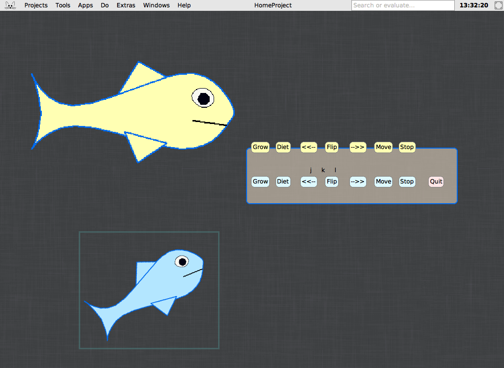

# Aquarium for Squeak

**Download, with Squeak 6.0 included:**
[**Linux**](https://github.com/edragoev1/aquarium-for-squeak/releases/latest/download/aquarium-for-squeak-1.0-linux-x64.tar.gz) ·
[**Windows**](https://github.com/edragoev1/aquarium-for-squeak/releases/latest/download/aquarium-for-squeak-1.0-windows-x64.zip) ·
[**macOS**](https://github.com/edragoev1/aquarium-for-squeak/releases/latest/download/aquarium-for-squeak-1.0-macos.zip)
(how to start it: [below](#download-and-play))



A small [Squeak](https://squeak.org) Smalltalk game, written in 2007 to show
how flexible Smalltalk is. Two fish swim around the screen and bounce off
its edges; you steer them from the control panel: **Grow**, **Diet**,
**<<--** and **-->>** (turn by 15 degrees), **Flip**, **Move** and **Stop**,
one row for each fish. The blue fish also answers the keyboard: **j** turns
it left, **k** flips it, **l** turns it right.

## Download and play

Squeak 6.0 is included; nothing else to install. Download the package of
your system (not GitHub's *Code → Download ZIP*, which is only the source):

| System | Download | Start |
|---|---|---|
| Linux (x86-64) | [aquarium-for-squeak-1.0-linux-x64.tar.gz](https://github.com/edragoev1/aquarium-for-squeak/releases/latest/download/aquarium-for-squeak-1.0-linux-x64.tar.gz) (28 MB) | `./aquarium.sh` |
| Windows (x86-64) | [aquarium-for-squeak-1.0-windows-x64.zip](https://github.com/edragoev1/aquarium-for-squeak/releases/latest/download/aquarium-for-squeak-1.0-windows-x64.zip) (26 MB) | double-click `Aquarium.bat` |
| macOS (Intel and Apple silicon) | [aquarium-for-squeak-1.0-macos.zip](https://github.com/edragoev1/aquarium-for-squeak/releases/latest/download/aquarium-for-squeak-1.0-macos.zip) (62 MB) | drag `Aquarium.image` onto `Squeak.app`, or double-click `Aquarium.command` |

On Linux, from a terminal:

```sh
curl -LO https://github.com/edragoev1/aquarium-for-squeak/releases/latest/download/aquarium-for-squeak-1.0-linux-x64.tar.gz
tar -xzf aquarium-for-squeak-1.0-linux-x64.tar.gz
cd aquarium-for-squeak-1.0-linux-x64 && ./aquarium.sh
```

The Linux package is tested; the Windows and macOS packages are built the
same way from Squeak's own downloads, but have not yet been tried on those
systems: if you try one, please say how it went in an issue. Windows may warn
about a program from the internet (choose *More info*, then *Run anyway*);
macOS may refuse `Aquarium.command` the first time (right-click it, choose
*Open*). `Squeak.app` is left exactly as the Squeak team signed it.

Or load it into a Squeak of your own (5.3 or later): put `Aquarium.st` and
`mcmFish.morph` beside its image and evaluate [`load.st`](load.st) in a
Workspace:

```smalltalk
(FileStream readOnlyFileNamed: 'Aquarium.st') fileIn.
ControlPanel new.
```

## What it teaches

The fish grow and shrink with one line each:

```smalltalk
grow
    self scale: self scale * 1.05.

diet
    self scale: self scale * 0.95.
```

`Fish` is a subclass of `TransformationMorph`, so the whole drawing,
outline, fins, eye and mouth, scales, turns and flips together, as it swims:
the behaviour comes from the class it inherits from, not from the game. And
more, in under 400 lines:

- **Objects and messages:** the buttons are `SimpleButtonMorph`s that send
  `grow`, `flip`, `rotateClockWise` to their fish, set up with `target:` and
  `actionSelector:` in `ControlPanel>>initialize`.
- **Processes:** each fish swims in a process of its own, forked in
  `Fish>>initialize:`, moving a few pixels every 15 milliseconds and flipping
  at the edges of the screen.
- **Events:** the blue fish takes the keyboard focus and handles `keyDown:`.
- **Objects saved as objects:** the fish was drawn once in Squeak 3.9 and
  saved as an object, `mcmFish.morph`; it is read back with
  `fileInObjectAndCode`, and still loads, nineteen years later, in Squeak 6.0.
- **A live system:** in the image of the packages, open the browser (*Tools*
  menu), find `Fish`, change `grow` to `* 1.5`, accept, and press **Grow**: the
  running game changes at once.

## The files

| File | What it is |
|---|---|
| [`Aquarium.st`](Aquarium.st) | The source: the classes `Fish` and `ControlPanel` |
| `mcmFish.morph` | The fish, a Morph saved by Squeak 3.9 in 2007 |
| [`load.st`](load.st) | Loads and starts it in any Squeak |
| [`tools/build-image.st`](tools/build-image.st) | Makes `Aquarium.image`: a fresh Squeak 6.0 with the game loaded and open |
| [`tools/package.sh`](tools/package.sh) | Builds the three packages from the official Squeak 6.0 downloads |

## History

Written by Evgeni Dragoev in January to March 2007 in Squeak 3.9, kept in
Subversion until 2008, then forgotten in some hundred copies on old drives.
In 2026 the newest code was salvaged from those copies and the game brought
to Squeak 6.0. The code was in zips of 2007 and 2008, a Subversion working
copy, and the `.changes` files of the Squeak images, where Squeak writes every
method as it is saved; the methods of all of them were read and compared, and
the newest, of the commit of 30 March 2008 (last edited 10 March 2007), kept.
Four small changes were needed for Squeak 5 and 6, which work in Squeak 3.9
too: `borderWidth:` and `borderColor:` in place of the deprecated
`setBorderWidth:borderColor:`; `Fish>>color:` answering before the fish has
its morph, as Squeak 5 sends `color:` from `initialize`; and
`Fish>>indicateKeyboardFocus` answering `false`, so that the blue fish, which
has the keyboard focus, is drawn without the frame Squeak 5 and later put
round the focus; and the control panel put at `0@0` before its buttons are
placed, as Squeak 5 and later open it below their menu bar, which pushed the
top row of buttons out of the panel.

The salvage, the upgrade to Squeak 6.0 and the packages were done by
[Claude](https://claude.com/claude-code), Anthropic's AI model, with Evgeni
Dragoev.

## License

The Aquarium: [MIT License](LICENSE). Squeak, in the packages to run it, is
under its own licenses, MIT and Apache 2.0: see
[squeak.org](https://squeak.org/downloads/).
